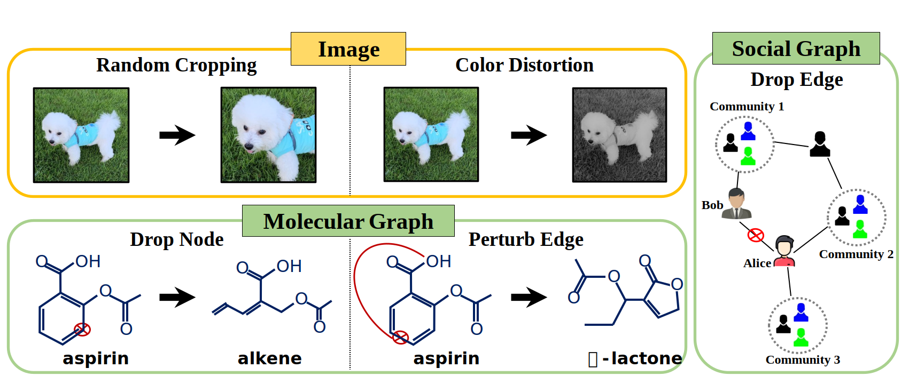

# Augmentation-Free Self-Supervised Learning on Graphs

<p align="center">   
    <a href="https://pytorch.org/" alt="PyTorch">
      </a>
    <a href="https://aaai.org/Conferences/AAAI-22/" alt="Conference">
        </a>
</p>

The official source code for [**Augmentation-Free Self-Supervised Learning on Graphs**](http://arxiv.org/abs/2112.02472) paper, accepted at AAAI 2022.

### Overview
Inspired by the recent success of self-supervised methods applied on images, self-supervised learning on graph structured data has seen rapid growth especially centered on augmentation-based contrastive methods. However, we argue that without carefully designed augmentation techniques, augmentations on graphs may behave arbitrarily in that the underlying semantics of graphs can drastically change. As a consequence, the performance of existing augmentation-based methods is highly dependent on the choice of augmentation scheme, i.e., hyperparameters associated with augmentations. In this paper, we propose a novel augmentation-free self-supervised learning framework for graphs, named AFGRL. Specifically, we generate an alternative view of a graph by discovering nodes that share the local structural information and the global semantics with the graph. Extensive experiments towards various node-level tasks, i.e., node classification, clustering, and similarity search on various real-world datasets demonstrate the superiority of AFGRL. 

</img> 

**Augmentations on images keep the underlying semantics, whereas augmentations on graphs may unexpectedly change the semantics.**

### Requirements

- Python version: 3.7.10
- Pytorch version: 1.8.1
- torch-geometric version: 1.7.0
- faiss: 1.7.0 

### Hyperparameters
Following Options can be passed to `main.py`

`--dataset:`
Name of the dataset. Supported names are: wikics, cs, computers, photo, and physics. Default is wikics.  
usage example :`--dataset wikics`

`--task:`
Name of the task. Supported names are: node, clustering, similarity. Default is node.  
usage example :`--task node`

`--layers:`
The number of units of each layer of the GNN. Default is [256]  
usage example :`--layers 256`

`--pred_hid:`
The number of hidden units of predictor. Default is [512]  
usage example :`--pred_hid 512`

`--topk:`
The number of neighbors for nearest neighborhood search. Default is 4.  
usage example :`--topk 4`

`--num_centroids:`
The number of centroids for K-means Clustering . Default is 100.  
usage example :`--num_centroids 100`

`--num_kmeans:`
The number of iterations for K-means Clustering . Default is 5.  
usage example :`--num_kmeans 5`

### How to Run

You can run the model with following options
- To run node classification (reproduce Table 2 in paper)
```
sh run_node_classification.sh
```

- To run node clustering (reproduce Table 3 in paper)
```
sh run_node_clustering.sh
```

- To run similarity search (reproduce Table 4 in paper)
```
sh run_similarity_search.sh
```

- or you can run the file with above mentioned hyperparameters
```
python main.py --embedder AFGRL --dataset wikics --task node --layers [1024] --pred_hid 2048 --lr 0.001 --topk 8
```
